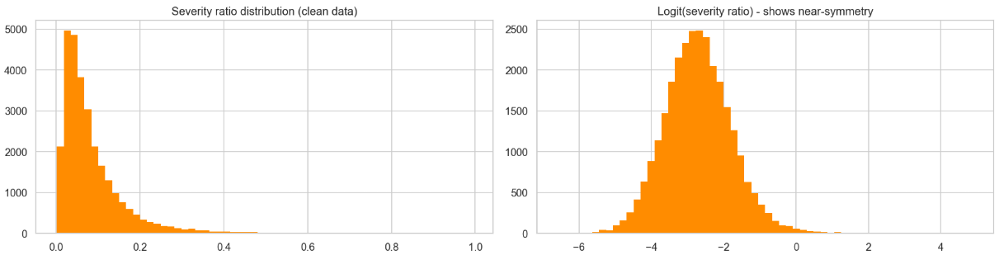
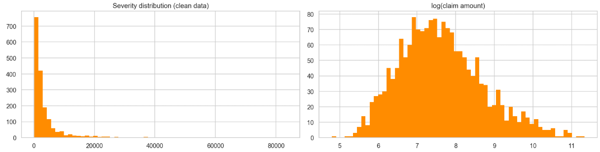
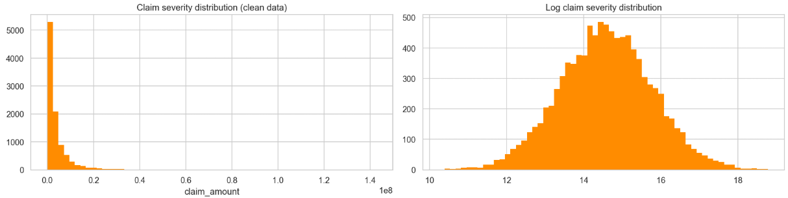

[](https://classroom.github.com/a/FxAEmrI0)
# Actuarial Theory and Practice A

_"Tell me and I forget. Teach me and I remember. Involve me and I learn." – Benjamin Franklin_

---

### Congrats on completing the [2026 SOA Research Challenge](https://www.soa.org/research/opportunities/2026-student-research-case-study-challenge/)!


> Now it's time to build your own website to showcase your work.  
> Creating a website using GitHub Pages is simple and a great way to present your project.

This page is written in Markdown.
- Click the [assignment link](https://classroom.github.com/a/FxAEmrI0) to accept your assignment.

---

> Be creative! You can embed or link your [data](player_data_salaries_2020.csv), [code](sample-data-clean.ipynb), and [images](ACC.png) here.

More information on GitHub Pages can be found [here](https://pages.github.com/).


## Objective Overview

This document covers the research and analysis performed by the actuarial team of Galaxy General Insurance Company (herein GGIC) to produce an insurance product suite for Cosmic Quarry Mining Corporation (herein CQMC) and their operations across multiple solar systems (Helionis Cluster, Bayesia System, and Oryn Delta). These insurance products target the client's four main operational hazards: Equipment Failure, Cargo Loss, Worker's Compensation, and Business Interruption.

## Data

Our pricing models were trained upon historical claims experience of a similar GGIC product suite, and can be viewed here:
- [Business Interruption Claims](https://www.soa.org/globalassets/assets/files/research/opportunities/2026/student-research-case-study/srcsc-2026-claims-business-interruption.xlsx)
- [Workers Compensation Claims](https://www.soa.org/globalassets/assets/files/research/opportunities/2026/student-research-case-study/srcsc-2026-claims-workers-comp.xlsx)
- [Cargo Loss Claims](https://www.soa.org/globalassets/assets/files/research/opportunities/2026/student-research-case-study/srcsc-2026-claims-cargo.xlsx)
- [Equipment Failure Claims](https://www.soa.org/globalassets/assets/files/research/opportunities/2026/student-research-case-study/srcsc-2026-claims-equipment-failure.xlsx)
- [Interest and Inflation Rates](https://www.soa.org/globalassets/assets/files/research/opportunities/2026/student-research-case-study/srcsc-2026-interest-and-inflation.xlsx)
- [Data Dictionary](https://www.soa.org/globalassets/assets/files/research/opportunities/2026/student-research-case-study/srcsc-2026-data.pdf)

CQMC-specific data was also provided to gain an understanding of their exposure:
- [CQMC Inventory](https://www.soa.org/globalassets/assets/files/research/opportunities/2026/student-research-case-study/srcsc-2026-cosmic-quarry-inventory.xlsx)
- [CQMC Personnel](https://www.soa.org/globalassets/assets/files/research/opportunities/2026/student-research-case-study/srcsc-2026-cosmic-quarry-personnel.xlsx)

## External Libraries

For analysis and modelling, the following libraries were used:
**Python**
```python
import pandas
import numpy
import scipy
import sklearn
import matplotlib
import seaborn
import statsmodels
import warnings
import patsy
```
**R**
```r

```

## Data Assumptions & Limitations

# Product Designs

#### Cargo Loss
Provides single-mission, all-risk coverage for physical loss or damage to declared cargo during transit, from operator handover to confirmed delivery. Claims are triggered by telemetry or post-arrival inspection, with cause-based deductibles reflecting incident severity. Coverage is conditional on full pre-launch risk disclosure and use of certified containers.

#### Equipment Failure
Covers repair or replacement costs for mechanical and electrical failures of mining equipment across multiple missions. Triggered by telemetry-confirmed operational failure, with deductibles scaled to usage intensity and environmental risk. Requires upfront disclosure of equipment characteristics and maintenance practices.

#### Workers’ Compensation
Provides protection for work-related injuries and illnesses, including those arising from space-specific hazards such as radiation and low gravity. Benefits include income replacement, medical costs, and lump-sum compensation, subject to medical verification confirming the incident occurred at the workplace

#### Business Interruption
Covers loss of income and ongoing expenses resulting from operational disruptions, including equipment failure, energy issues, or environmental hazards. Claims are subject to a waiting period and risk-based deductibles, reflecting the high severity but low frequency of interruptions. Periodic policy reviews and environmental compliance checks are conducted annually or biannually to ensure adherence to operational protocols. 

# Model Building

Model Building was conducted to estimate how often claims across the four hazard areas occur, and how large their expected claims would be. Analysis of the model and the construction of model involved EDA, data cleaning, and setting assumptions. Across all four hazard areas, frequency distributions were modelled using either a negative binomial or a poisson distribution, with the level of dispersion being them main differentiator. Severity distributions were modelled using visualisations of the data . Variables that were insignificant were also removed. This included variables with a p-value greater than 0.05, which was chosen as the threshold given the large size of the dataset, and any non-significant coefficient terms. Analysis on the adjusted R squared was done to explain the explatory power, and AIC and Pearson dispersion was used to determine the goodness of the fit of the model. Below contains the formulas used to model frequency and severity, and the decisions behind how we modelled it.

#### Cargo Loss
With a dispersion level of 4.51, which was calculated by the variance divided by the mean, frequency was modelled using a negative binomial GLM model using the following:
```
freq_formula = (
    'claim_count ~ C(route_risk_cat, Treatment(reference="1"))'
    ' + C(container_type_cat, Treatment(reference="longhaul vault canister"))'
    ' + debris_density_z + pilot_experience_z + solar_radiation_z'
)

freq_glm = smf.glm(
    formula=freq_formula,
    data=freq_model_df,
    family=sm.families.NegativeBinomial()
).fit()
print(freq_glm.summary())
```

This yielded parameters of r = 0.5370 and p = 0.6868.

A severity ratio model was constructed for cargo loss, with the ratio being ```severity_ratio = claim_amount / cargo_value```. Under the assumption that claim amount is always less than the cargo value, a Beta GLM was determined to be the best fit through a visaulisation of the severity ratio data. 


This was then modelled using the the severity formula:
```
sev_formula = (
    'severity_ratio ~ C(route_risk_cat, Treatment(reference="1"))'
    ' + debris_density_z + solar_radiation_z'
)

y_sev, X_sev = dmatrices(sev_formula, data=sev_model_df, return_type='dataframe')
y_sev_arr = y_sev.values.ravel()

sev_beta = BetaModel(y_sev_arr, X_sev).fit(disp=False)
print(sev_beta.summary())
```

The parameters were as follows: α = 1.3832 and β = 14.3850.

#### Equipment Failure
Pearson dispersion was measured as 1.0956, which is very close to 1, thus a poisson GLM was used to model for frequency. A frequency parameter of λ = 0.1839667 was yielded. The modelling is done as follows:
```
freq_formula = (
    'claim_count ~ '
    'C(equipment_type_cat, Treatment(reference="reglaggregators")) + '
    'C(solar_system_cat, Treatment(reference="helionis cluster")) + '
    'equipment_age_z + maintenance_int_z + usage_int_z'
)

freq_glm = smf.glm(
    formula=freq_formula,
    data=freq_model_df,
    family=sm.families.Poisson(),
    offset=freq_model_df['log_exposure']
).fit()

print(freq_glm.summary())
```

A gamma GLM was used to model for severity. A gamma distribution was chosen due to claim sizes being positive and right skewed, and thus, the log link function was chosen to ensure positive predictions and multiplicative effects. A gamma dispersion parameter of 0.231 was yielded, which is very good for a severity model. The modelling is as follows:
```
sev_formula = (
    'claim_amount ~ C(equipment_type_cat)'
    ' + C(solar_system_cat)'
    ' + equipment_age_z'
    ' + usage_int_z'
)

# -----------------------------
# 4. Fit Gamma GLM
# -----------------------------
sev_glm = smf.glm(
    formula=sev_formula,
    data=sev_model_df,
    family=sm.families.Gamma(link=sm.families.links.log())
).fit()

print(sev_glm.summary())
```

The parameters yielded were: shape = 4.32, scale = 11,100.

#### Workers' Compensation
A dispersion of 0.115 was yielded for frequency, thus a poisson GLM model was used. A parameter of λ = 0.017665 was also yielded. The modelling is as follows:
```
model_pois = smf.glm(
    formula="""
    claim_count ~ occupation  + accident_history_flag + psych_stress_index + safety_training_index
    """,
    data=freq_clean,
    family=sm.families.Poisson(),
    offset=np.log(freq_clean['exposure'])
).fit()
print(model_pois.summary())
```

For severity, a log-normal distribution was used as the claim amounts were very heavily right skewed with extreme fat tails. Visualisation was done as follows:


Thus, modelling was also done in the similar fashion to the others, with parameters of μ = 7.19821 and σ = 1.0786.
```
model_lognormal = smf.ols(
    formula="""
    log_claim ~ occupation + psych_stress_index + gravity_level + safety_training_index + protective_gear_quality
    """,
    data=sev_clean
).fit()

print(model_lognormal.summary())
```

#### Business Interruption
Similar to cargo loss, a negative binomial GLM was used as the dispersion parameter was 1.73. Modelling was done as follows:
```
freq_formula = (
    'claim_count ~ C(solar_system_cat, Treatment(reference="zeta"))'
    ' + C(energy_backup_score_cat, Treatment(reference="1"))'
    ' + supply_chain_index_z'
    ' + maintenance_freq_z'
    ' + avg_crew_exp_z'
)

freq_glm = smf.glm(
    formula=freq_formula,
    data=freq_model_df,
    family=sm.families.NegativeBinomial(),
    offset=freq_model_df['log_exposure']
).fit()

print(freq_glm.summary())
```

The parameters yielded were: r = 0.121553, p = 0.54720.

Similar to equipment failure, a gamma GLM was used to model for severity, getting parameters of shape = 0.3538, scale = 12,327,906. Similar reasoning as to why we chose a gamma distribution applies. The visualisation is as follows.


The code we used is as follows.
```
sev_formula = (
    'claim_amount ~ C(solar_system_cat, Treatment(reference="zeta"))'
    ' + energy_backup_score_z + safety_compliance_z'
)

sev_glm = smf.glm(
    formula=sev_formula,
    data=sev_model_df,
    family = sm.families.Gamma(link=sm.families.links.Log())
).fit()

print(sev_glm.summary())
```

# Capital Modelling

The capital modelling was conducted to quantify the potential financial loss of each product line. The stochastic aggregate loss models are built for each hazard: Equipment Failure, Cargo Loss, Workers’ Compensation, and Business Interruption. 

The aggregate annual loss is modelled through a compound frequency and severity framework, where frequency and severity distributions for each line were estimated using historical claims data. Combining the number of claims in a year and the claim amounts retrieved through 100,000 Monte Carlo simulations, the aggregate loss distributions capture loss statistics including expected loss, variance and extreme tail events. 

#### Methodology

Our capital modelling process involves four key steps:
  1. Cleaning and validating historical claim data.
  2. Estimating parameters of separate frequency and severity distributions for each line of businesses.
  3. Simulating annual aggregate losses using Monte Carlo simulation.
  4. Summarising key metrics including expectation, variance, and Value-at-Risk (VaR).

#### Model Choices

| Line of Business | Frequency Model | Severity Model |
|---|---|---|
| Equipment Failure | Poisson | Gamma |
| Cargo Loss | Negative Binomial | Beta × cargo value |
| Business Interruption | Negative Binomial | Gamma |
| Workers’ Compensation | Poisson | Lognormal |

#### Simulation Logic

In each iteration of the Monte Carlo simulation implemented, the annual claim count is simulated first from the frequency distributions fitted, followed by individual claim severities simulated using fitted severity distributions. Summing up the claim amounts allows us to obtain total annual loss.

A simple example - Equipment Failure aggregate loss simulation

```r
# 1. Inputs
r_cargo <- 0.5370
p_cargo <- 0.6868
a_cargo <- 1.3832
b_cargo <- 14.3850

cargo_values <- cargo_data_raw$cargo_value
cargo_values <- cargo_values[!is.na(cargo_values) & cargo_values > 0]

# 2. Simulate aggregate cargo loss
cargo_loss <- numeric(n_sim)

for(i in 1:n_sim){
  
  n_claims <- rnbinom(1, size = r_cargo, prob = p_cargo)
  
  if(n_claims > 0){
    damage_ratio <- rbeta(n_claims, shape1 = a_cargo, shape2 = b_cargo)
    sampled_values <- sample(cargo_values, size = n_claims, replace = TRUE)    
    losses <- damage_ratio * sampled_values
    cargo_loss[i] <- sum(losses)
  }
}

# 3. Summary table
var95_cargo  <- as.numeric(quantile(cargo_loss, 0.95))
var99_cargo  <- as.numeric(quantile(cargo_loss, 0.99))
var995_cargo <- as.numeric(quantile(cargo_loss, 0.995))
```

This logic was applied to each product line, using their unique fitted distributions listed in the section above.

#### Aggregate Loss Simulation Results

| Metric | Equipment Failure | Cargo Loss | Business Interruption | Workers’ Compensation |
|---|---:|---:|---:|---:|
| Expected annual loss ($) | 8,935 | 1,978,730 | 443,322 | 67.93 |
| Standard deviation ($) | 23,011 | 11,396,840 | 2,958,488 | 943.56 |
| VaR 95% ($) | 61,858 | 6,597,604 | 596,933 | 0 |
| VaR 99% ($) | 103,491 | 57,528,540 | 13,684,392 | 1,672.69 |
| VaR 99.5% ($) | 120,090 | 83,444,880 | 21,261,136 | 3,720.63 |

The aggregate loss distributions are strongly right-skewed across all four products given their extremely large VaR. Cargo Loss and Business Interruption are the main tail-risk drivers due to the material size of their loss, while Equipment Failure and Workers’ Compensation are comparatively stable and manageable.


#### Stress testing

We tested two stressed scenarios in addition to the baseline scenario:
- **Moderate stress:** claim frequency +25%, claim severity +10%
- **Extreme stress:** claim frequency +50%, claim severity +30%

| Product | Baseline VaR 99% | Moderate Stress | Extreme Stress |
|---|---:|---:|---:|
| Equipment Failure | 102,773 | 129,148 | 157,252 |
| Business Interruption | 59,961,210 | 76,315,150 | 94,751,300 |
| Cargo Loss | 13,684,390 | 18,918,430 | 26,962,710 |
| Workers’ Compensation | 1,673 | 2,494 | 3,430 |

Under systematic stress, tail losses rise sharply for all four products, especially for Business Interruption and Cargo Loss. This reveals that these two products require the greatest capital support to comply with the regulatory requirement and internal risk tolerance, which also would benefit most from stop-loss reinsurance protection.

#### Inflation Adjustment

As a final but important step, we accounted for inflation by indexing claim severities by **2.46%** per annum (15-year average inflation rate). This adjustment is relevant to:

  - Repair and replacement for **Equipment Failure**.
  - Value of goods transported for **Cargo Loss**.
  - Cost of disrupted operations for **Business Interruption**.
  - Claim costs over time for **Workers’ Compensation**.

This adjustment increases both expected loss and tail risk of the simulated results.


# Risk Considerations

#### Correlated Risk Scenarios
Common external shocks such as solar storms introduce positive dependence between claim frequency and severity, as multiple solar systems may simultaneously experience disruptions. This leads to a heavier-tailed aggregate loss distribution than the independence assumption implies. The three solar systems differ meaningfully in their vulnerability to correlated events. 
  - Bayesia System faces the greatest exposure to radiation-driven correlation, as its binary stars can produce simultaneous radiation spikes that elevate equipment failure and workers' compensation claims across all stations concurrently.
  - Oryn Delta carries compounding risk, where dwarf star flares combined with asteroid disturbances could simultaneously trigger cargo loss, equipment failure, and business interruption across multiple sites.
  - Helionis Cluster, while more stable, remains exposed to correlated debris events given its two outer asteroid clusters, which could affect multiple transit routes simultaneously.

#### Threats & Mitigation Strategy
Risks for each product lines were evaluated and mitigation strategies were provided.

##### Cargo Loss
| Threats | Likelihood | Severity | Rating | Mitigation |
|---|:---|:---|:---|:---|
| Solar storm/flare      | Moderate | Very High | Critical | Exclusion clause: Solar exclusion is predicted but undisclosed |
| Debris field collision | Mod-High | High | High | Route declaration; density rating |
| Total vessel loss      | Low | Catastrophic | High | Tier 1 deductible; Stop-loss reinsurance  |
| Container failure      | Moderate | Moderate | Medium | Container certification |
| Pilot error            | Moderate | Moderate | Medium | Experience rating factor |
| Route deviation        | Low | Variable | Medium | Exclusion clause |
| Willful misconduct     | Low | Variable | Low-Med | Exclusion clause; identified via investigation |

##### Equipment Failure
| Threats | Likelihood | Severity | Rating | Mitigation |
|---|:---|:---|:---|:---|
| Mechanical component failure             | Moderate | High      | High | Preventative maintenance requirements |
| Control system / AI malfunction          | Low-Mod  | Very High | High | Diagnostic monitoring and system redundancy |
| Radiation damage to electronics          | Moderate | High      | High | Radiation shielding and solar system risk rating |
| Structural fatigue from heavy extraction | Moderate | High      | High | Equipment age rating and inspection requirements |
| Debris impact on equipment               | Low-Mod  | High      | Medium-High | Protective shielding and environmental risk pricing |
| Poor maintenance practices               | Moderate | Moderate  | Medium | Maintenance documentation and compliance requirements |

##### Workers' Compensation
| Threats | Likelihood | Severity | Rating | Mitigation |
|---|:---|:---|:---|:---|
| On-site injury (slips, trips, falls)     | Moderate | High      | High | Safety training, protective gear, and workplace inspections |
| Exposure to hazardous materials          | Low-Mod  | High      | High | Personal protective equipment and monitoring protocols |
| Fatigue-related accidents                | Moderate | Moderate      | Medium | Shift scheduling, rest periods, and workload monitoring |
| Gravity or environmental hazards         | Low-Mod  | High      | Medium-High | Environmental controls, gravity-adapted equipment, and hazard awareness training |
| Equipment misuse by staff                | Moderate | Moderate      | Medium | Standard operating procedures and supervision |
| Wilful misconduct                        | Low      | Variable  | Low-Med | Policy exclusions and investigation procedures |

##### Business Interruption
| Threats | Likelihood | Severity | Rating | Mitigation |
|---|:---|:---|:---|:---|
| Major equipment malfunction                 | Moderate | High      | High | Preventative maintenance programs, equipment redundancy, and predictive monitoring systems |
| Solar storm / extreme environmental event   | Low-Mod  | Very High | High | Hardened infrastructure, radiation shielding, and early warning space weather systems |
| Energy system failure                       | Moderate | High      | Medium-High | Backup power systems, redundant energy grids, and energy storage capacity |
| Supply chain disruption                     | Moderate  | Medium-High      | Medium | Diversified suppliers, inventory buffers, and alternative transport routes |
| Infrastructure failure (station systems)    | Low-Mod | High      | Medium | Infrastructure inspections, redundancy in critical systems, and scheduled upgrades |
| Operational shutdown due to a safety incident | Low      | Medium  | Low-Med | Strict safety protocols, worker training programs, and automated monitoring systems |


#### ESG considerations
ESG criteria are embedded as practical underwriting conditions:
  - **Environmental:** waste-management plans and debris-mitigation compliance, with premium discounts of up to 5% available for verified adoption of lower-impact extraction technologies. 
  - **Social:** minimum safety training and protective gear standards for workers' compensation.
  - **Governance:** controls including third-party compliance verification and sanctions screening apply across all solar systems.


